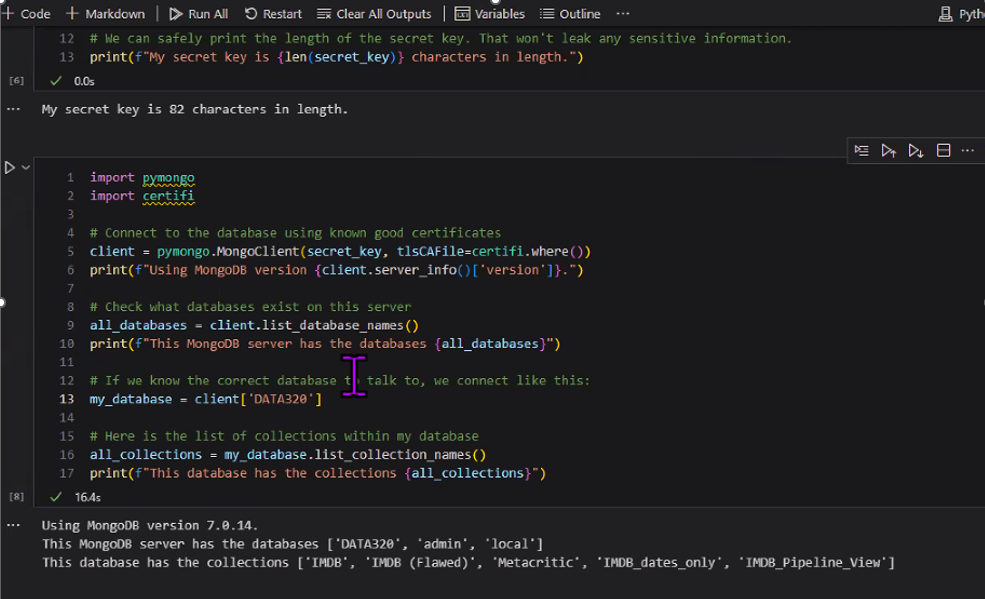

# 🎬 MongoDB IMDB Analytics

Python and MongoDB analytics project exploring movie datasets through NoSQL queries, regex filtering, Pandas workflows, and Jupyter-based data analysis.



---

## 📊 Project Overview

This project demonstrates how to connect MongoDB Atlas datasets with Python to retrieve, process, and analyze movie information from IMDB and Metacritic collections.

The repository combines:
- MongoDB Atlas connectivity
- NoSQL querying
- Regex-based filtering
- Pandas data processing
- Exploratory data analysis (EDA)
- Movie rating analytics
- Jupyter Notebook workflows
- Visualization and reporting

The project focuses on practical analytics workflows commonly used in data engineering and business intelligence environments.

---

## 🛠 Tools & Technologies

- Python
- MongoDB Atlas
- Pandas
- pymongo
- Jupyter Notebook
- certifi
- Regex
- JSON
- Data Visualization

---

## 📂 Repository Structure

```text
notebooks/        # Jupyter notebooks and MongoDB workflows
documentation/    # Tutorials and setup guides
visualizations/   # Charts and analytics visuals

## Setup

To run this project locally, you need to have Python and MongoDB installed. If you don't have them yet, follow these instructions:

1. **Install MongoDB**: [MongoDB Installation Guide](https://www.mongodb.com/docs/manual/installation/)
2. **Install Python dependencies**:
   ```bash
   pip install pymongo pandas
