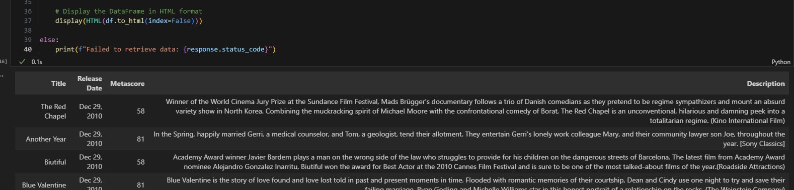
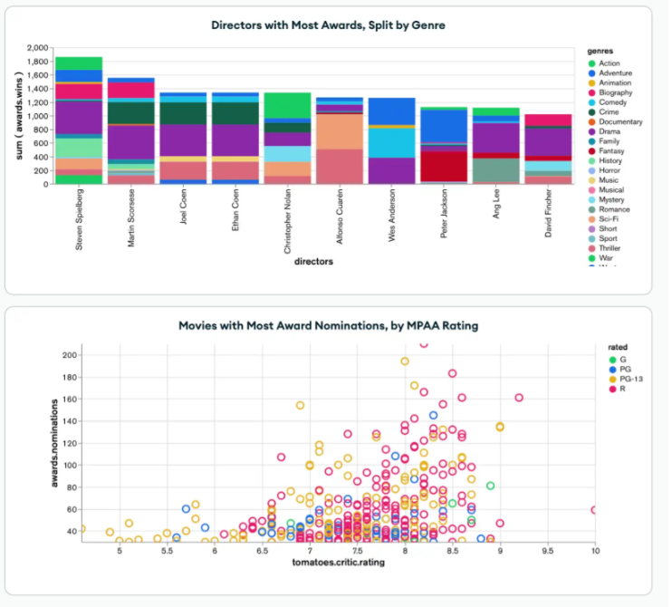
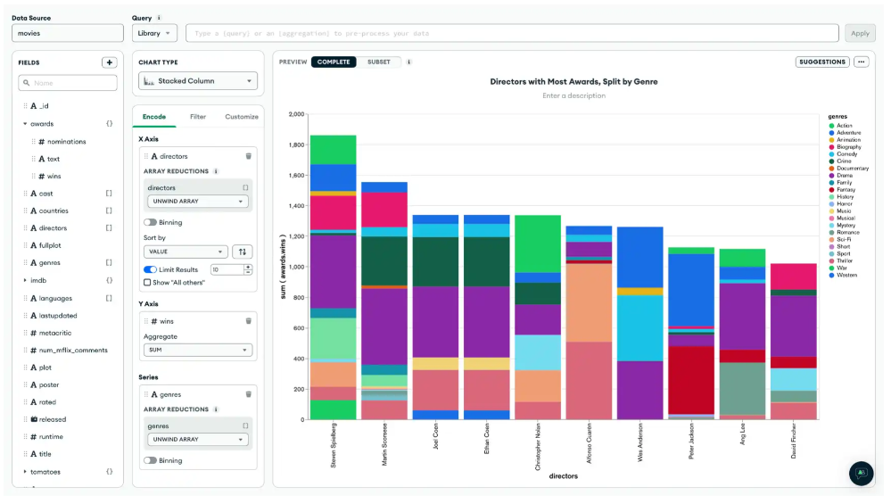

# 🎬 MongoDB IMDB Analytics

Python and MongoDB analytics project exploring movie datasets through NoSQL queries, regex filtering, Pandas workflows, and Jupyter-based data analysis.


---

## 📊 Project Overview

This project demonstrates how to connect MongoDB Atlas datasets with Python to retrieve, process, and analyze movie information from IMDB and Metacritic collections.

The repository combines:
- MongoDB Atlas connectivity
- NoSQL querying
- Regex-based filtering
- Pandas data processing
- Exploratory data analysis (EDA)
- Movie rating analytics
- Jupyter Notebook workflows
- Visualization and reporting

The project focuses on practical analytics workflows commonly used in data engineering and business intelligence environments.

---

## 🛠 Tools & Technologies

- Python
- MongoDB Atlas
- Pandas
- pymongo
- Jupyter Notebook
- certifi
- Regex
- JSON
- Data Visualization

---

## 📂 Repository Structure

```text
notebooks/        # Jupyter notebooks and MongoDB workflows
documentation/    # Tutorials and setup guides
visualizations/   # Charts, screenshots, and analytics visuals
data/             # Dataset examples and exports
```

---

## 📚 Tutorials & Documentation

### MongoDB Atlas Charts Tutorial

Step-by-step walkthrough demonstrating:
- MongoDB Atlas connections
- Querying movie datasets
- Regex filtering
- DataFrame creation
- Movie analytics workflows

File:

```text
documentation/mongodb-atlas-charts-tutorial.md
```

---

## 🔍 Analytics Features

- Movie rating analysis
- Genre-based filtering
- Regex search workflows
- MongoDB collection queries
- JSON document analysis
- Pandas transformations
- Data sorting and filtering
- Visualization workflows

---

## 📷 Project Visualizations

### Jupyter Notebook Workflow


### Movie Ratings Analysis


### Genre Distribution Analysis


---

## 🔍 Skills Demonstrated

- MongoDB Atlas connectivity
- NoSQL database querying
- Python data analysis
- Regex filtering
- JSON document handling
- Pandas workflows
- Exploratory data analysis
- Jupyter Notebook development
- Data visualization

---

## 🚀 Learning Outcomes

Through this project, I practiced:
- connecting Python applications to MongoDB Atlas
- retrieving and transforming movie datasets
- querying semi-structured NoSQL data
- building analytics workflows with Pandas
- visualizing movie-related datasets
- combining database and analytics concepts into end-to-end workflows

---

## 📌 Dataset Sources

- MongoDB Atlas Sample Dataset (Mflix)
- IMDB movie-related datasets
- Metacritic collections

---

## 👩‍💻 Author

Eva Samitova  
BAS Data Management & Analytics — Bellevue College

## Setup

To run this project locally, you need to have Python and MongoDB installed. If you don't have them yet, follow these instructions:

1. **Install MongoDB**: [MongoDB Installation Guide](https://www.mongodb.com/docs/manual/installation/)
2. **Install Python dependencies**:
   ```bash
   pip install pymongo pandas
